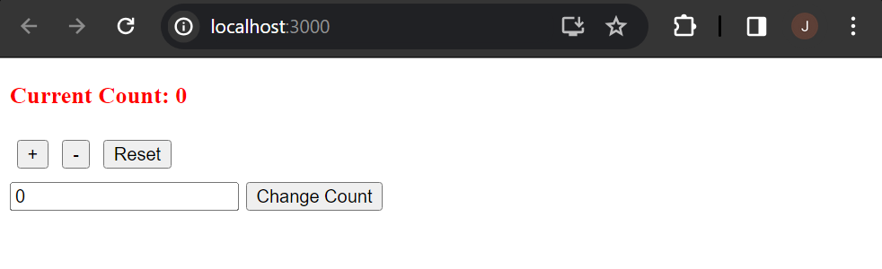
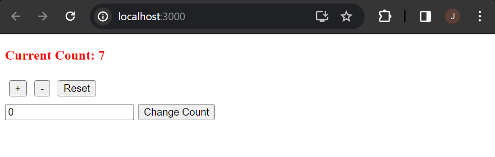
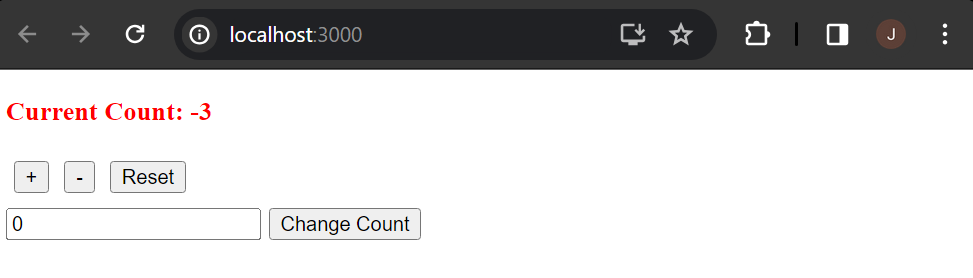
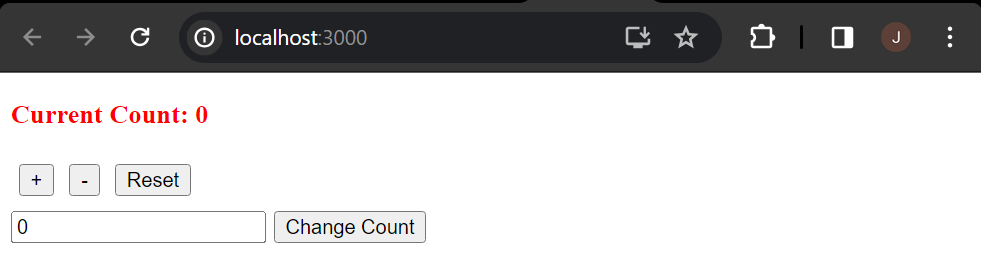
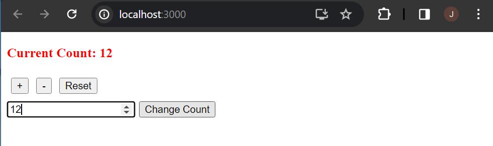

# web603-class-w8d1

## Getting Started

Create the React app named "redux-counter" by
```bash
$ npx create-react-app redux-counter
```

With `redux-counter/` being the current directory, install the following dependencies by
```bash
$ npm install redux react-redux redux-thunk @reduxjs/toolkit

$ npm install --save-dev @babel/runtime typescript
```

Replicate the files as in the Code Sandbox given, and complete the code based on the in-class demo.

## Test

### App Home
Initial count is 0.


### Clicking "+" Button
To have the count incremented by 1.


### Clicking "-" Button
To have the count decremented by 1.


### Clicking "Reset" Button
To have the count reset to initial count, 0.


### Clicking "Change Count" Button
To have the count changed to the number input by user.
